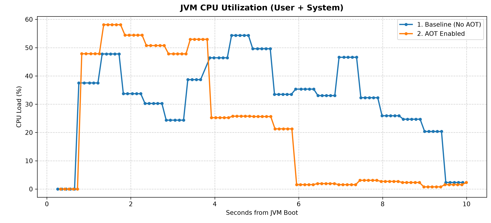
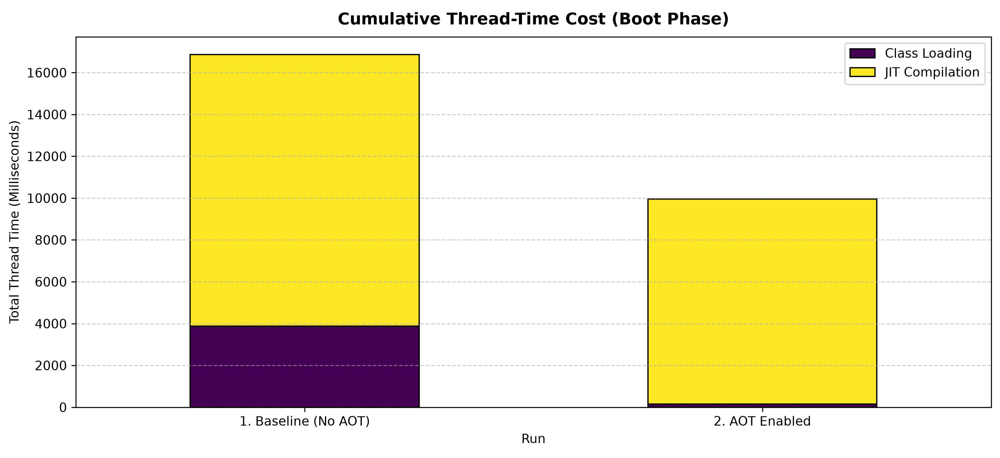

Tack
====

A [Paperclip](https://github.com/PaperMC/Paperclip) launcher using [Project Leyden](https://openjdk.org/projects/leyden/)
Ahead-of-Time (AOT) caches to improve Paper startup performance.

Downloads are available from the [releases page](https://github.com/PaperMC/tack/releases).

Installing
----------

You can use `tack` by keeping it in your server directory and calling it locally via `./tack` (or on Windows:
`.\tack.exe`). You can also place it somewhere on your `PATH` to use it as a regular command.

Building
--------

Building requires the nightly Rust toolchain.

```shell
cargo build --release
```

### Usage

Drop `tack` in to the command you use to start Paper, replacing `java` with `tack`. You must specify the Paper jar using
`-jar <paper.jar>`. `tack` is generally compatible with all JVM and application flags you were already using, except
`-cp` or other classpath arguments other than `-jar`.

```shell
java @aikars.flags -Dpaper.disableOldApiSupport=true -jar paper.jar nogui
```
becomes:
```shell
tack @aikars.flags -Dpaper.disableOldApiSupport=true -jar paper.jar nogui
```

See `tack --help` for full usage instructions.

### AOT Management

For technical details on what the AOT cache is, see the Ahead-of-Time Cache section below. This will just talk about
using AOT features in tack.

There are seven run modes:

| **Mode**         | **Argument**     | **Behavior**                                                                                                                                                                                                                                                                                                                      |
|------------------|------------------|-----------------------------------------------------------------------------------------------------------------------------------------------------------------------------------------------------------------------------------------------------------------------------------------------------------------------------------|
| **Default**      | `<none>`         | Tack will record an AOT cache if it is missing or it does not match the current setup. If the cache file matches the current setup it will be used instead. This is the default, simply do not provide any of the following other arguments to use it.                                                                            |
| **Check AOT**    | `--check-aot`    | Check the status of the current AOT cache file. If it matches, tack will immediately return with exit code `0`. If it does not match (or does not exist), it will return with exit code `1`. This can be useful as a check in an automated script.                                                                                |
| **Only Use AOT** | `--only-use-aot` | tack will require a valid AOT cache file to run. If one is not present, or the existing file is incompatible, it will refuse to start the server and return with exit code `33` instead.                                                                                                                                          |
| **No Record**    | `--no-record`    | tack will use a valid AOT cache file if one is present. If one is not present, or the existing file is incompatible, it will skip using the AOT cache for this run. This can be useful if you want the server to startup normally (not incurring the startup time penalty of recording a new cache) if the cache becomes invalid. |
| **Only Record**  | `--only-record`  | tack will record a new AOT cache file if one is missing or the existing cache file is invalid. If the existing cache file is valid, tack will immediately return with exit code `0`. If tack does record a new AOT cache it will immediately shut the server down once it has fully started and finished writing the AOT cache.   |
| **Force Record** | `--force-record` | This option behaves the same as `--only-record`, except that there is no AOT cache validity check. It will always record a new AOT cache file, and it will always immediately stop the server once the AOT cache file has been fully written.                                                                                     |
| **No AOT**       | `--no-aot`       | All AOT features will be completely disabled. This is essentially no different from running the Paper jar directly with `java`.                                                                                                                                                                                                   |

Only one of these options may be used at any given time. To use one of these arguments it **MUST** be the first argument
presented on the command line, right after `tack` (e.g. `tack --check-aot`).

When using tack with the default setting, on the first run tack will initiate the AOT cache recording
automatically. Once the server has completed startup, it will write the cache to disk and write the associated metadata
file with it that allows for cache integrity checks. Any future server runs with the same configuration will use and
benefit from that AOT cache file.

> [!IMPORTANT]
> In order for tack to use the AOT cache file the full run setup must be _identical_ to the run that recorded it.
> This includes:
>  * The full classpath (including):
>    * The server jar
>    * All library jars
>    * The SHA-256 hash of all classpath jars
>  * The complete JVM argument list (order matters)
>  * The SHA-256 hash of the AOT cache file itself
> If any of these values don't match, the AOT cache will be marked invalid and will need to be re-recorded.

### Java Compatibility

The minimum Java version you can run with tack is strictly Java 26. While Java 24 and 25 also support using AOT caches,
they have issues with how they record the AOT cache. We've found using Java 26 to be the most reliable.

Control which version of Java tack uses through the `JAVA_HOME` environment variable. If that variable isn't set, tack
will fall back to where `java` is found on the `PATH`.

### Ahead-of-Time Cache

The reason tack exists is to provide a simple-to-use wrapper around [Project Leyden](https://openjdk.org/projects/leyden/)
Ahead-of-Time (AOT) cache files. These caches provide a significant reduction in server startup time by recording and
re-using class loading data from previous server runs. Tack provides utilities for easily managing and using AOT files
with Paper servers. **This is ideally used for applications where Paper servers are stopped and started frequently.**
Examples may include development environments or minigame servers.

#### AOT: What benefits does it provide?

In general, the AOT cache will cut the server startup time in half. This has been remarkably consistent across a variety
of platforms, operating systems, and devices. The reasoning is straightforward: the Minecraft server needs to load a
_lot_ of classes. By pre-computing and saving information about these classes the JVM needs to do dramatically less work
on startup before the server is in a fully started state.

Here are some charts to help visualize where the AOT cache helps.

#### AOT: CPU Utilization


CPU utilization drops off much quicker when using AOT. Since there is less work to do, the full boot process of the
server startup period finishes halfway through the regular startup time. Part of this is the JVM's built-in class
profiling information (which helps the JIT compiler make decisions about how to compile the bytecode) is re-used from
AOT cache, so that work doesn't need to be re-done.

#### AOT: Thread-Time Cost


To help put a finer point on the CPU utilization, this chart shows the dramatic reduction in both class loading and JIT
compilation. The primary benefit the AOT cache provides is during class loading, which you can see is almost entirely
eliminated with the AOT cache. But the JIT compilation improvements are significant too, with the AOT cache run doing
roughly 33% less JIT compilation work than the regular run.

#### AOT: JIT Intensity


Finally, to combine the findings of the two charts into one, this chart shows the amount of runtime the JVM is spending
towards JIT compilation of the classes during the class loading process. This may be the most dramatic of the three
charts, as the drop off of the orange AOT run almost perfectly drops to 0 halfway through the non-AOT run.
